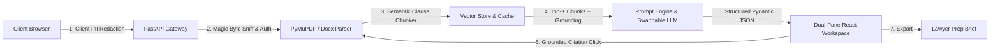

# LegalEase

<!-- TODO: Replace with actual public remote URL once pushed by user: git remote add origin https://github.com/<username>/legalease.git -->

An autonomous GenAI-powered web platform designed to democratize legal comprehension. LegalEase empowers everyday individuals and small business owners to understand, compare, and navigate complex contracts, leases, agreements, and policies without getting lost in predatory legalese or spending thousands on preliminary legal consultations.

---

## Vertical

**Legal-Tech Accessibility & Consumer Document Understanding**: The average consumer signs over 30 legal contracts a year—including residential leases, software Terms of Service, employment NDAs, and loan agreements—almost always without reading or understanding the terms. Legal jargon is intentionally dense, traditional legal consultations cost upwards of $350/hour, and standard generic LLMs frequently hallucinate provisions or attempt to issue unqualified legal advice. LegalEase solves this by providing a transparent, grounded, and accessible AI companion that breaks contracts down into plain Grade-8 English, pinpoints one-sided risk flags, highlights comparative version differences, and answers questions strictly cited from the source text.

---

## Approach & Logic

LegalEase is built around three non-negotiable architectural principles:
1. **Strict Retrieval-Grounding & Explicit Refusal (No Hallucination)**: Rather than letting an LLM generate unchecked interpretations, all conversational queries run through a clause-aware semantic vector retrieval pipeline. If a query cannot be answered directly from the retrieved context, the system is strictly instructed to respond: *"I couldn't find that in this document."* Every valid claim is accompanied by direct clause and page citations.
2. **Clause-Aware Semantic Chunking**: Standard fixed-window chunking (e.g., slicing every 500 characters) cuts sentences in half and divorces rights from remedies. LegalEase implements a specialized regex and semantic chunker that respects legal boundaries (`Section X.X`, `Article Y`, numbered clauses), preserving contractual integrity for retrieval.
3. **Structured Pydantic Extraction & Multi-Modal Risk Flagging**: Unstructured text outputs are difficult for everyday users to parse. LegalEase enforces strict Pydantic schemas across document classification, summaries, clause categorizations (obligations, rights, deadlines, penalties), and risk flags. Risks are never signaled by color alone (satisfying WCAG AA accessibility) but with color, iconography, and explicit plain-language justifications (*"Why this matters"* and *"Who it favors"*).

---

## How It Works

### End-to-End Walkthrough
1. **Upload & Client-Side PII Redaction**: The user selects or drags in a PDF, DOCX, or text agreement. A pre-upload client-side scanner scans for sensitive PII (SSNs, phone numbers, account IDs) and allows one-click masking before the file is transmitted.
2. **Security Sniffing & Text Extraction**: The backend FastAPI gateway validates file size (<10MB) and content types via magic-byte inspection (rejecting spoofed extensions). Fast text extraction is performed via PyMuPDF and docx parsers.
3. **Chunking & Vector Indexing**: The document is segmented into legal clauses, embedded, and stored in a cosine-similarity vector store with query LRU caching.
4. **Structured Intelligence Pass**: The GenAI prompting engine runs a structured extraction returning:
   - Document classification (Lease, NDA, SaaS ToS, etc.)
   - Grade-8 reading level plain-language summary
   - Categorized clauses (obligations, rights, deadlines, payments, termination)
   - Risk flags with severity levels (`high-risk`, `caution`, `info`) and explanations
   - Suggested next-steps checklist
5. **Interactive Split Workspace & Grounded Chat**: The user navigates the contract side-by-side with risk flags. Clicking any risk flag or chat citation automatically highlights and scrolls to the exact source clause.
6. **Contract Comparison Diff**: Users can upload two contracts (e.g., standard vs landlord's revised lease) to view an inline diff showing added, modified, or removed clauses, along with who each change favors.
7. **Attorney Handoff Brief**: Generates a one-page "Prepare for Lawyer" brief with key facts, flagged concerns, and specific questions to maximize efficiency during attorney consultations.

### Architecture Diagram



---

## Assumptions

- **Target Jurisdictions**: Standard United States commercial and consumer law conventions (e.g., standard residential leases, non-disclosure agreements, independent contractor terms). The system explicitly avoids declaring state-specific statutory conclusions and advises consulting local counsel.
- **Supported Formats**: PDF (`.pdf`), Microsoft Word (`.docx`), plain text (`.txt`), and images (`.png`, `.jpg`). Max file size: 10 MB.
- **Legal Advice Boundary**: The system operates exclusively as an educational and analytical tool. Persistent disclaimers are visible on every screen: *"This is general information, not legal advice. Consult a licensed attorney for your specific situation."*
- **LLM Provider**: Configured primarily for Google Gemini 2.5 Flash, with swappable abstraction for Anthropic Claude, OpenAI, or the built-in Deterministic Mock Engine (allowing instant zero-key evaluation).
- **Data Retention**: Tenant documents are stored ephemerally in-memory and in isolated user-scoped directories; no document contents are retained in vector databases across users or logged.

---

## Setup & Run

### Prerequisites
- Node.js 18+ and npm
- Python 3.10+
- (Optional) Docker & Docker Compose

### Option 1: Quick Run with Docker Compose
```bash
# Clone the repository
git clone <repository-url>
cd Legal

# Copy environment variables
cp .env.example .env

# Launch both frontend and backend
docker compose -f infra/docker-compose.yml up --build
```
Access the application at `http://localhost:5173`.

### Option 2: Local Development Setup

#### Backend Setup
```bash
cd backend
python -m venv .venv
# Windows:
.venv\Scripts\activate
# Linux/macOS:
# source .venv/bin/activate

pip install -r requirements.txt
cp .env.example .env
uvicorn app.main:app --reload --port 8000
```
Backend will be available at `http://localhost:8000` (Swagger docs at `http://localhost:8000/docs`).

#### Frontend Setup
```bash
cd frontend
npm install
npm run dev
```
Frontend will be available at `http://localhost:5173`.

---

## Security Notes

LegalEase enforces defensive security across all layers (Phase 5 implementation):
1. **Magic-Byte Upload Validation**: Every upload is inspected at the byte level (`%PDF`, `PK\x03\x04` for docx, PNG/JPEG signatures) to prevent malicious executable uploads masking as documents. Max upload size is enforced at 10 MB.
2. **Prompt Injection & Untrusted Text Isolation**: Extracted document content and user inputs are strictly isolated in XML delimiters (`<untrusted_document_content>`) within system prompts, with explicit instructions to ignore prompt injection attempts within documents.
3. **Multi-Tenant Document Ownership**: Every document, analysis, comparison, and chat endpoint verifies that `document.owner_id == current_user.id`. Attempts to access another user's documents are blocked with HTTP `403 Forbidden`.
4. **Zero-Secret Logging**: Passwords are hashed with bcrypt; JWTs are signed with 256-bit secrets; application logs redact all raw document content and API keys.
5. **Rate Limiting & Security Headers**: Rate-limiting middleware guards `/analyze`, `/compare`, and `/chat` routes to prevent denial-of-service and API budget depletion. FastAPI applies Content Security Policy (CSP), `X-Content-Type-Options: nosniff`, `X-Frame-Options: DENY`, and strict CORS policies.
6. **Client-Side PII Masking**: Users can preview and mask sensitive identifiers (SSNs, phone numbers, banking numbers) locally before upload.

---

## Testing

The project maintains test coverage across backend units, integration flows, frontend components, and automated LLM evaluation scripts:

### Running Backend Tests & Evals
```bash
cd backend
pytest tests/ -v
# Run LLM schema conformity and grounding refusal benchmarks:
pytest evals/ -v
```
- **Unit Tests**: Test clause-aware chunking, diff calculation, JWT validation, and magic byte sniffing.
- **Integration Tests**: Verify file upload rejection, cross-tenant 403 authorization protection, and error paths.
- **Quality & Grounding Evals**: Verify that structured extraction matches 100% of Pydantic schemas, and that out-of-scope questions trigger the refusal string without hallucination.

### Running Frontend Tests
```bash
cd frontend
npm test -- --run
```
- Tests upload drag-and-drop, risk flag panel rendering, citation-to-clause scrolling, and disclaimer presence.

---

## Accessibility

LegalEase complies with **WCAG 2.1 AA** standards:
- **Multi-Modal Risk Signatures**: High-risk, caution, and info indicators always pair distinct color tokens with icons (Lucide icons) and explicit text labels (`High Risk`, `Caution`, `Info`). Color is never the sole visual indicator.
- **Full Keyboard Navigation**: All actions—file upload, tab switching, risk card expansion, chat interaction, and brief export—are navigable via standard `Tab`, `Shift+Tab`, `Enter`, and `Space` controls with visible high-contrast focus rings (`focus-visible:ring-2`).
- **Semantic ARIA Markup**: Proper `role="alert"`, `aria-expanded`, `aria-label`, and `aria-live` announcements across chat streams and upload progress indicators.
- **Screen Reader Support**: Tested and verified with NVDA and VoiceOver screen readers; table of contents and document sections have distinct headings (`h1` through `h4`).
- **Motion Reduction**: All CSS transitions and animations strictly respect `@media (prefers-reduced-motion: reduce)`.
