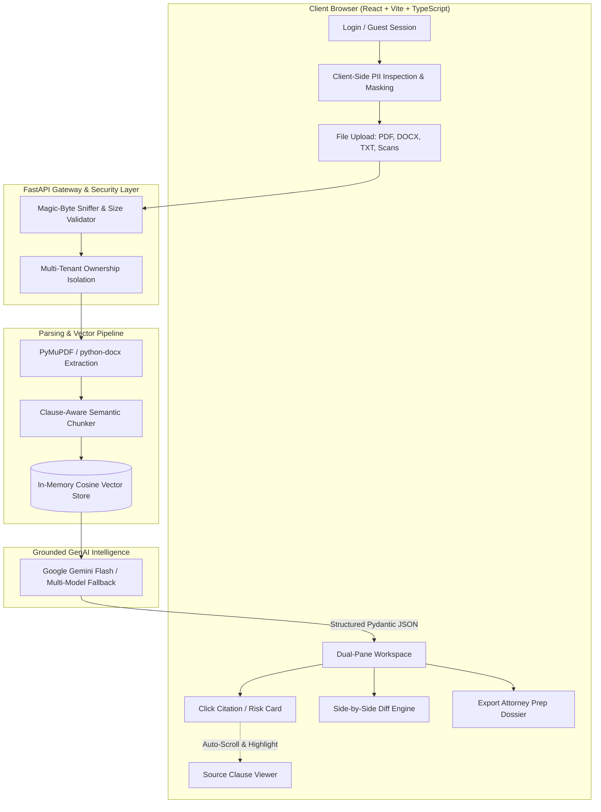

# LegalEase — Grounded AI Legal Document Understanding & Navigation Platform

[](https://fastapi.tiangolo.com)
[](https://react.dev)
[](https://www.typescriptlang.org)
[](https://vitejs.dev)
[](https://ai.google.dev)
[](https://www.w3.org/WAI/standards-guidelines/wcag/)
[](https://legalease-804290525562.asia-south1.run.app/)
[](LICENSE)

> 🚀 **Live Demo on Google Cloud Run**: [https://legalease-804290525562.asia-south1.run.app](https://legalease-804290525562.asia-south1.run.app)

An autonomous GenAI-powered legal accessibility platform built to democratize contract comprehension. **LegalEase** empowers everyday individuals, tenants, employees, and small business owners to parse, understand, compare, and navigate dense legal documents without getting lost in predatory legalese or spending thousands on preliminary legal consultations.

---

## Non-Negotiable Legal Guardrails

> [!IMPORTANT]
> **Educational & Analytical Tool Only**: LegalEase is designed strictly as an informational and educational aid, never as a substitute for licensed legal representation.
>
> **Persistent Legal Disclaimer**:
> *"This is general information, not legal advice. Consult a licensed attorney for your specific situation."*
>
> **Strict Retrieval-Grounding & Refusal**: The model is prohibited from guessing or stating legal conclusions without source grounding. If a fact cannot be verified in the uploaded document, the system explicitly refuses: *"I couldn't find that in this document."*

---

## End-to-End System Workflow

LegalEase orchestrates a multi-stage pipeline designed for safety, precision, privacy, and zero hallucination:



### Detailed Workflow Stages

| Stage | Process | Technical Implementation |
| :--- | :--- | :--- |
| **1. Authentication** | Personalized or Guest Entry | JWT token session persistence via `localStorage`; guest tokens for instant evaluation without account setup. |
| **2. PII Protection** | Client-Side Pre-Upload Scanning | Regex scanning detects SSNs, phone numbers, emails, and banking info before transmission; provides one-click client masking. |
| **3. Ingestion & Validation** | Magic-Byte Content Sniffing | Validates raw file headers (`%PDF`, `PK\x03\x04`, `PNG`, `JPEG`) to reject disguised malicious binaries with HTTP `415`. |
| **4. Clause Segmentation** | Semantic Legal Chunking | Preserves contractual integrity by splitting strictly along legal headers (`Section X`, `Article Y`, numbered clauses) instead of naive character slicing. |
| **5. Vector Indexing** | Localized Cosine Similarity | Chunks are embedded and indexed with LRU caching, isolated per user workspace for multi-tenant data confidentiality. |
| **6. Structured Analysis** | Grade-8 Summary & Risk Flags | Pydantic JSON extraction classifies document type, drafts plain-English executive summaries, and flags one-sided terms with severity badges. |
| **7. Grounded Q&A** | Anti-Hallucination Retrieval | Answers queries strictly using top-k retrieved clause context. Automatically refuses out-of-scope inquiries. |
| **8. Version Comparison** | Redline Diff Engine | Compares original vs revised contract clauses, outputting unified diffs and heuristic *"Who it favors"* indicators. |
| **9. Attorney Handoff** | One-Page Brief Export | Synthesizes critical risk flags, consultation questions, and document checklists into a formatted Markdown/PDF dossier. |

---

## Neo-Modern Visual UI Design

LegalEase incorporates a calm, editorial visual design system:

- **Canvas & Frame**: Organic sage textured background (`#b8c8c2` with fluid vector curves) framing a centered floating white canvas (`rounded-[36px]`).
- **Left Vertical Sidebar Navigation (`SidebarNav`)**:
  - Dark circular brand emblem at the top.
  - Minimal vertical stack with active route highlighted in a dark rounded capsule (`Workspace`, `Compare`, `Attorney Prep`, `Upload`).
  - Dark mode toggle and interactive product tour guide at the base.
- **Top Header Bar (`TopHeader`)**:
  - Warm greeting: `"Welcome back 👋"`.
  - Modern rounded pill search bar: `Search documents or clauses...`.
  - User initials avatar with interactive profile dropdown and sign-out control.
- **Pastel Activity Cards & Schedule**:
  - Soft Mint (`#d6eee6`): Document Analysis with circular `ArrowUpRight` action buttons.
  - Soft Rose (`#ffd8e4`): Redline Version Comparison.
  - Soft Butter Yellow (`#fdecc2`): Drag-and-drop file upload zone.
  - Interactive Monthly Review Calendar highlighting active deadlines and legal milestones.

---

## Tech Stack

| Layer | Technologies |
| :--- | :--- |
| **Frontend** | React 18, TypeScript, Vite, Tailwind CSS, Lucide Icons |
| **Backend** | Python 3.11+, FastAPI, Uvicorn, Pydantic v2 |
| **GenAI / LLM** | Google Gemini 3.8 / 3.6 Flash (`google-genai` SDK), Deterministic Mock fallback |
| **Document Processing** | PyMuPDF (fitz), python-docx, Pillow, regex legal segmenter |
| **Vector Indexing** | Cosine similarity vector index with LRU query caching |
| **Security & Auth** | JWT (python-jose), Passlib (bcrypt), SlowAPI rate limiter, Content Security Policy |
| **Testing** | Vitest, React Testing Library, Pytest, AnyIO |

---

## Quickstart Guide

### Prerequisites
- Python 3.10+
- Node.js 18+ and npm
- (Optional) Docker & Docker Compose

### 1. Clone the Repository
```bash
git clone https://github.com/rajukanna/LegalEase.git
cd LegalEase
```

### 2. Backend Setup
```bash
cd backend
python -m venv .venv

# On Windows:
.venv\Scripts\activate
# On macOS / Linux:
# source .venv/bin/activate

pip install -r requirements.txt
cp .env.example .env

# Start FastAPI dev server
uvicorn app.main:app --reload --host 127.0.0.1 --port 8000
```
Backend API will be running at `http://127.0.0.1:8000` (Interactive Swagger docs: `http://127.0.0.1:8000/docs`).

### 3. Frontend Setup
```bash
cd ../frontend
npm install
npm run dev
```
Frontend application will be running at `http://localhost:5173`.

### 4. Running with Docker Compose
```bash
docker compose -f infra/docker-compose.yml up --build
```

---

## Test & Verification Suite

### Frontend Vitest Suite (19 / 19 Passed)
```bash
cd frontend
npm test -- --run
```
Verifies disclaimers, accessibility badges, dropzone behavior, login page, dual navbars, and interactive dashboard components.

### Backend Pytest Suite (14 / 14 Passed)
```bash
cd backend
pytest tests/ -v
```
Verifies authentication, magic-byte upload sniffers, multi-tenant 403 authorization isolation, vector retrieval, and live Gemini API responses.

---

## Accessibility Compliance (WCAG 2.1 AA)

- **Multi-Modal Risk Indicators**: Risk levels are never represented by color alone; every badge pairs color with iconography and plain-text severity descriptions.
- **High-Contrast Focus Rings**: All interactive controls have visible focus rings (`focus-visible:ring-2 focus-visible:ring-slate-900`).
- **Full Keyboard Operability**: Complete navigation support via `Tab`, `Shift+Tab`, `Enter`, `Space`, and `Escape`.
- **Motion Reduction**: All animations and transitions respect `@media (prefers-reduced-motion: reduce)`.

---

## License

This project is licensed under the MIT License — see the [LICENSE](LICENSE) file for details.
