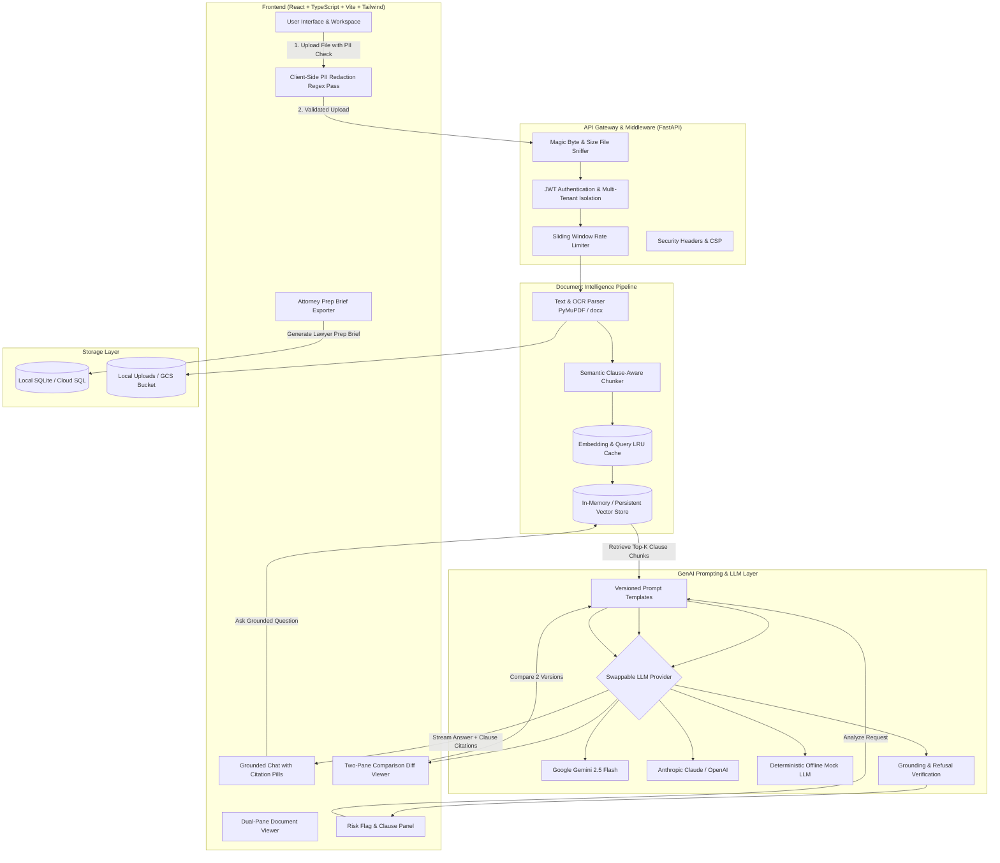

# LegalEase System Architecture

LegalEase provides an end-to-end, grounded, AI-assisted legal document understanding system. It transforms complex, dense contracts and policies into plain-language summaries, color-coded risk flags, side-by-side diffs, and grounded conversational Q&A.

## Architecture Diagram

## Core Components

1. **Client-Side Layer**:
   - Built with React 18, TypeScript, and Vite.
   - Zero-dependency client-side regex/NER scanner detects and masks sensitive PII (SSNs, account numbers, names, phone numbers) before files leave the browser.
   - WCAG AA accessible interface with dual-pane layout: original contract on the left, plain-language breakdown and risk indicators on the right.
   - Grounded citations link directly to line numbers and text spans in the document.

2. **Backend API (FastAPI)**:
   - Strict Pydantic models for request/response validation.
   - JWT authentication ensuring strict multi-tenant isolation (users cannot access another tenant's documents).
   - Security filters: magic-byte content validation, rate limiting, and prompt injection isolation using strict XML delimitation.

3. **Document Ingestion & Semantic Chunking**:
   - `PyMuPDF` (`fitz`) and `python-docx` extract structured paragraphs and section titles.
   - Clause-aware chunker identifies legal structures (`Section 1.2`, `ARTICLE IV`, numbered clauses) preserving semantic context rather than cutting off sentences arbitrarily.

4. **Vector Retrieval & Swappable LLM Engine**:
   - Vector store computes cosine similarity across embedded chunks.
   - Grounding check: queries with low retrieval relevance immediately trigger fallback refusal (*"I couldn't find that in this document."*).
   - LLM provider abstraction supports Google Gemini, Anthropic Claude, and an offline Deterministic Mock Provider for instant, zero-key evaluation.
